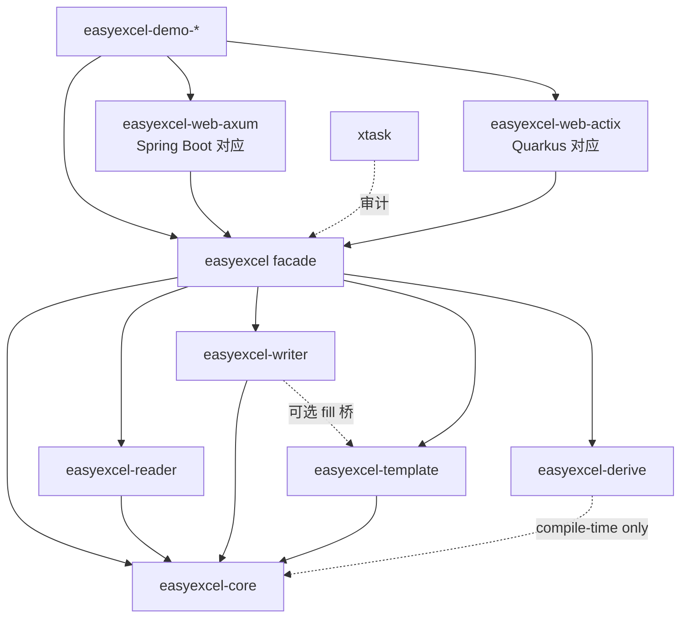

# EasyExcel-Rs 最终实施计划

> **版本**：v2.0（整合 codegraph 双侧审计 + sa-token-rs / hitool-rs 模板 + Web/JSON 生态映射）  
> **基线 Java**：EasyExcel **4.0.3**（`/Users/wandl/workspaces/workspace-github/easyexcel` @ `3afdea9d`）  
> **目标仓库**：`/Users/wandl/workspaces/workspace-github/easyexcel-rs` @ `7ac0e40`  
> **参考项目**：
> - `sa-token-rs`（`crates/` monorepo、`xtask` 审计、`sa-token-web-{axum,actix}`、demo 矩阵）
> - `hitool-rs`（命名对齐、分阶段补齐、`IMPLEMENTATION_PLAN` 体例）
> - 本仓已有：`docs/ARCHITECTURE.md` / `docs/compatibility.md` / `docs/migration/*`  
> **定位**：一比一复刻 Alibaba EasyExcel 的 Rust 实现；对象/方法/参数命名严格对齐；反射 → proc-macro；POI → 纯 Rust 引擎；**JSON：Jackson/Fastjson → serde**；**Web：Spring Boot → axum，Quarkus → actix**  
> **状态**：待批准后按阶段执行；**不以「测试绿」替代账本 complete**

---

## 目录

- [一、项目背景与目标](#一项目背景与目标)
- [二、固定基线与统计口径](#二固定基线与统计口径)
- [三、当前真实状态（诚实审计）](#三当前真实状态诚实审计)
- [四、核心设计原则](#四核心设计原则)
- [五、命名映射规则](#五命名映射规则)
- [六、Workspace 总体结构（对齐 sa-token-rs）](#六workspace-总体结构对齐-sa-token-rs)
- [七、Maven 模块 → Cargo crate 映射](#七maven-模块--cargo-crate-映射)
- [八、核心类型 / Trait 签名](#八核心类型--trait-签名)
- [九、关键技术决策汇总](#九关键技术决策汇总)
- [十、Web / JSON 生态映射（Spring→axum · Quarkus→actix · Jackson→serde）](#十web--json-生态映射springaxum--quarkusactix--jacksonserde)
- [十一、分阶段实施计划](#十一分阶段实施计划)
- [十二、依赖清单](#十二依赖清单)
- [十三、测试体系](#十三测试体系)
- [十四、迁移文档体系](#十四迁移文档体系)
- [十五、风险与缓解](#十五风险与缓解)
- [十六、验收命令](#十六验收命令)
- [十七、Phase 0 立即执行清单](#十七phase-0-立即执行清单)
- [附录 A：Java ↔ Rust 包/文件对应（节选）](#附录-ajava--rust-包文件对应节选)
- [附录 B：能力边界（刻意不移植）](#附录-b能力边界刻意不移植)
- [附录 C：参考项目](#附录-c参考项目)
- [附录 D：codegraph 读/写路径对照](#附录-dcodegraph-读写路径对照)

---

## 一、项目背景与目标

### 1.1 背景

Alibaba **EasyExcel** 是 Java 生态最常用的 Excel 读写库之一，核心能力包括：

- **事件驱动读取**：SAX/流式解析 XLSX，避免整表进内存
- **注解模型映射**：`@ExcelProperty` 等运行时反射生成头与转换链
- **写入生命周期**：Workbook / Sheet / Row / Cell 四级 `WriteHandler` 链
- **转换器体系**：`Converter<T>` + `DefaultConverterLoader` 按 `(JavaType, CellDataType)` 分发
- **模板填充**：`{key}` / `{.}` / `FillWrapper` / `FillConfig`
- **多格式**：XLSX / XLS(BIFF8) / CSV，含部分加密与样式
- **Web 样例**：`easyexcel-test/.../demo/web` 基于 **Spring Boot + Servlet** 做上传/下载（JSON 错误体用 Fastjson2）

**Rust 生态现状**：

- `calamine` / `rust_xlsxwriter` / `csv` 等碎片化，缺少 EasyExcel 级编程模型
- Java 用户迁移时心智模型断裂（Builder、Listener、Handler、Converter）
- 本仓 `easyexcel-rs` **已存在** `crates/` monorepo 与大量实现，但仍缺 sa-token-rs 级「账本 + 严格审计 + xtask + web/demo 子树」闭环

### 1.2 目标

| 维度 | 目标 |
|---|---|
| **API 心智** | `EasyExcel::read` / `write` / `fill` + Builder + Listener/Handler，对齐 Java |
| **命名** | 类型 PascalCase 保留；方法/字段 snake_case；业务动词不翻译 |
| **结构** | 对齐 `sa-token-rs` 的 `crates/` monorepo + 嵌套 `*-web` / `*-demo` + `xtask` + `docs/migration/file-map.csv` |
| **反射替代** | `#[derive(ExcelRow)]` 编译期生成 `ExcelRow` / schema / write metadata |
| **JSON** | Java **Jackson / Fastjson2** → Rust **`serde` + `serde_json`**（统一序列化表面） |
| **Web** | Java **Spring Boot** → **`easyexcel-web-axum`**；Java **Quarkus**（若有/未来 starter）→ **`easyexcel-web-actix`** |
| **引擎** | XLSX：`quick-xml` 读 + `rust_xlsxwriter` 写；XLS：calamine 读 + 自研 BIFF8 写；CSV：`csv` + `encoding_rs` |
| **文档注释** | rustdoc 标注「原 Java 类/方法」 |
| **完成定义** | 账本 `complete` = 真实实现 + 可重复测试证据；禁止仅凭「有文件」标完成 |

### 1.3 非目标

- ❌ 不复刻 Apache POI 公共 API 表面（无 `org.apache.poi.*` 暴露）
- ❌ 不追求字节码级 1:1；错误模型统一为 `Result<T, ExcelError>`
- ❌ 不把 DOCX/OFD/PDF 做进本仓（见 `docs/ecosystem-roadmap.md`）
- ❌ 不静默把 `.xls` 写成 `.xlsx` 字节（路径扩展名与格式强绑定）
- ❌ 不复刻 JVM-only：自定义 `SAXParserFactory` 类名、完整 HSSF 调色板等
- ❌ 不在 core 引入 axum/actix（Web 只落在 `easyexcel-web-*`）

---

## 二、固定基线与统计口径

### 2.1 Java 基线（codegraph 实测 @ `3afdea9d`）

| 指标 | 值 |
|---|---|
| 仓库 | `/Users/wandl/workspaces/workspace-github/easyexcel` |
| 版本 | **4.0.3**（`pom.xml` `<revision>`） |
| Git | `3afdea9d` |
| `main` 业务 `.java` | **325**（`easyexcel-core` 323 + `easyexcel` 1 + `easyexcel-support` 1） |
| 全仓 `.java`（含 test） | **533** |
| 测试类（`easyexcel-test`） | ≈ 204 文件 / demo 42 文件（`fill/rare/read/web/write`） |

**Maven 模块**：

```text
easyexcel-parent
├── easyexcel-core      # 几乎全部业务代码（com.alibaba.excel.*）
├── easyexcel-support   # Empty 占位
├── easyexcel           # 门面依赖聚合（EasyExcel extends EasyExcelFactory）
└── easyexcel-test      # 集成 / demo / 回归测试（含 Spring Web 样例）
```

**`com.alibaba.excel` 包分布（main，按一级包）**：

| 包 | 文件数 | 职责 |
|---|---:|---|
| `write` | 62 | 写入、Handler、样式、merge、fill |
| `converters` | 53 | 默认/读写转换器 |
| `metadata` | 45 | Cell/Head/Holder/属性 |
| `analysis` | 42 | ExcelAnalyser + XLSX/XLS/CSV 执行器 |
| `util` | 24 | 工具 |
| `read` | 24 | Builder / Listener / metadata |
| `enums` | 18 | 枚举 |
| `annotation` | 14 | `@ExcelProperty` 等 |
| `context` | 10 | Analysis/Write 上下文 |
| `exception` / `event` / `cache` / `constant` / `support` / root | 其余 | 异常、事件、缓存、常量、门面 |

### 2.2 Rust 基线（codegraph 实测 @ `7ac0e40`）

| 指标 | 值 |
|---|---|
| 仓库 | `/Users/wandl/workspaces/workspace-github/easyexcel-rs` |
| Git | `7ac0e40` |
| `.rs` 源文件（crates，含测试） | ≈ **500** |
| 生产侧 `.rs`（排除 `tests.rs` / `tests/`） | ≈ **452** |
| 现有 crates | `easyexcel` / `core` / `derive` / `reader` / `writer` / `template` |
| Edition / resolver / MSRV | **2024** / **3** / **1.88** |
| 文档自报测试 | **1315+**（以 CI/`cargo test` 为准；账本另计） |

### 2.3 迁移账本口径（对齐 sa-token-rs）

迁移账本目标路径：[`docs/migration/file-map.csv`](migration/file-map.csv)（**Phase 0 必须新建**）。

每一行记录：

| 列 | 含义 |
|---|---|
| `java_file` | Java 源相对路径（`easyexcel-core/src/main/java/...`） |
| `rust_file` | Rust 源相对路径（`crates/...`） |
| `target_crate` | `easyexcel` / `easyexcel-core` / `easyexcel-reader` / `easyexcel-web-axum` / … |
| `rust_type` | 主类型名（struct/trait/enum） |
| `capability` | `read` / `write` / `fill` / `converter` / `handler` / `annotation` / `util` / `web` / `json` / `ignore` |
| `status` | `planned` / `in_progress` / `complete` / `handle` / `ignore` |
| `test_evidence` | 测试名或 golden 路径；`complete` 必填 |
| `source_commit` | Java 基线提交 `3afdea9d` |

约束：

- `java_file` ↔ `rust_file` **双向唯一**（一对多用多行 + `capability` 区分）
- `package-info.java`、纯 POI 适配胶水标 `ignore` 并写原因
- **有代码 ≠ complete**；无测试证据不得升为 `complete`
- Web demo / JSON 错误体单独记 `capability=web|json`，不与 core Excel 能力混算完成度

---

## 三、当前真实状态（诚实审计）

> 综合 codegraph 探索、`MIGRATION_STATUS.md`、`compatibility.md`、`codegraph-gap-audit.md`。  
> **注意**：`MIGRATION_STATUS.md` 中存在「Phase E complete」与同文件「Phase 2–7 pending」并存的矛盾；**以本计划第三节与账本为准**，后续统一状态文件。

### 3.1 已具备（可视为工程基线）

- [x] `crates/` workspace：`easyexcel` / `core` / `derive` / `reader` / `writer` / `template`
- [x] Edition **2024**、resolver **3**、MSRV **1.88**、`unsafe_code = forbid`
- [x] 门面 `EasyExcel::{read, read_sync, write, fill_template, fill_template_list, writer_sheet, ...}`
- [x] `ExcelRow` + `#[derive(ExcelRow)]` 替代运行时反射
- [x] `ReadListener` / `AnalysisEventListener` / `PageReadListener` / `SyncReadListener`
- [x] `WriteHandler` 折叠四级生命周期 + style/merge 钩子
- [x] `Converter` + `ConverterRegistry` + `DefaultConverterLoader` 镜像
- [x] XLSX SAX 读、CSV 读写、XLS 读（calamine）、Minimal BIFF8 写
- [x] XLSX Agile 加密读写路径、模板填充（OOXML）、golden / parity 测试套件
- [x] workspace 已声明 `serde` / `serde_json`（尚缺「JSON 错误体 / Web DTO」统一约定文档）
- [x] 文档：`ARCHITECTURE` / `GUIDE` / `compatibility` / migration 树与矩阵

### 3.2 相对 sa-token-rs 仍缺的工程能力

| 项 | sa-token-rs | easyexcel-rs 现状 | 计划 |
|---|---|---|---|
| `xtask` 迁移审计 | ✅ `migration-audit` / `strict` | ❌ 无 | Phase 0 |
| `file-map.csv` 全量账本 | ✅ | ❌ | Phase 0 |
| 嵌套 `*-web/{axum,actix}` | ✅ | ❌ | Phase F |
| 嵌套 `*-demo/{axum,actix,...}` | ✅ | ❌ | Phase F |
| 严格「全量 complete」收口 | ✅ | 部分凭测试数宣称完成 | Phase G |
| Jackson/Fastjson → serde 契约 | ✅（serializer） | ⚠️ 仅依赖声明 | Phase F |

### 3.3 能力缺口（产品语义）

| 领域 | 状态 | 说明 |
|---|---|---|
| XLSX 读写 / 监听 / 转换器 | ✅ 高 | 主路径已对齐 |
| CSV 多 charset / BOM | ✅ 高 | JVM 专有 charset 不移植 |
| XLS 读 | ✅ | 物化进内存（非 SAX） |
| XLS 写（BIFF8） | 🟡 | Minimal 编码器；样式/图/批注有限 |
| XLS 加密（RC4） | 🟡/❌ | 需补齐或永久 `Unsupported` + 文档 |
| XLS 模板 fill | 🟡 | 部分已有；需账本逐项证据 |
| Handler 子 trait 拆分 | 🟡 | Java 四级接口；Rust 单 trait（可补 marker subtrait） |
| `WriteTable` 三参 overload | 🟡 | 需 facade 暴露 + 证据 |
| POI `handle()` 访问 | 🟡 | 刻意无 POI；用空实现或文档 HANDLE |
| 图片 EMF/WMF/锚点高级 | 🟡 | 部分 pending |
| **Web 适配（Spring/Quarkus）** | ❌ | 未建 `easyexcel-web-*` / demo |
| **JSON 错误体（Jackson/Fastjson）** | ❌ | Web 失败路径需 `serde_json` 契约 |

---

## 四、核心设计原则

### 原则 1：单一 idiomatic Rust API + 命名对齐 Java

不做第二套「compat」门面。类型名、业务动词对齐 Java；签名做 Rust 化（`Result`、`&str`、`IntoIterator`）。

### 原则 2：依赖单向（无环）——对齐 sa-token-rs



约束：

- `easyexcel-core` **不依赖** 其他 workspace crate，**不依赖** axum/actix
- reader / writer / template **只向内**依赖 core
- web adapter **只依赖** facade（或 facade + core 公共类型），禁止反向依赖 demo
- facade 用 feature 门控可选能力（含 `web-axum` / `web-actix`）
- 禁止测试反向依赖成环

### 原则 3：反射 → 编译期元数据

| Java | Rust |
|---|---|
| `@ExcelProperty` 运行时扫描 | `#[excel(...)]` + `ExcelRow::schema()` 静态切片 |
| `ModelBuildEventListener` | `ExcelRow::from_row` / `to_row` |
| `ClassUtils` ThreadLocal 缓存 | 无；编译期烤进二进制 |

### 原则 4：错误折叠

Java 多异常类 → 单一 `ExcelError`（`thiserror`）+ `Result<T>`；监听器 `on_exception` → `ErrorAction::{Stop, Continue, SkipRow}`。

### 原则 5：格式与扩展名诚实

- `.xlsx` / `.xls` / `.csv` 分派明确
- 不支持时返回 `ExcelError::Unsupported("...")`，**禁止静默降级**

### 原则 6：已有实现不删减

历史模块路径通过 `pub use` 保留；收敛时只加导出、不删用户可用 API（对齐 hitool-rs）。

### 原则 7：完成度以账本为准

对齐 sa-token-rs：`in_progress` 仅表示有目标路径；`complete` 必须有 `test_evidence`。

### 原则 8：JSON / Web 框架固定映射（本版新增）

| Java 生态 | Rust 生态 | 说明 |
|---|---|---|
| **Jackson** / Fastjson2 / `ObjectMapper` | **`serde` + `serde_json`** | DTO、错误 JSON、配置反序列化一律 serde |
| **Spring Boot**（MVC / WebFlux 样例） | **`axum`** | `easyexcel-web-axum` + `easyexcel-demo-axum` |
| **Quarkus**（RESTEasy / Vert.x 样例） | **`actix-web`** | `easyexcel-web-actix` + `easyexcel-demo-actix` |
| Servlet `HttpServletResponse` 流 | `impl AsyncWrite` / `Body` 流式写出 | 对齐 `autoCloseStream` 语义 |

> Java 官方 demo 当前用 **Spring + Fastjson2**；本计划按用户统一约定：JSON → serde，Spring → axum，Quarkus → actix（即使上游暂无 Quarkus 模块，也预留对称 crate，对齐 sa-token-rs）。

---

## 五、命名映射规则

### 5.1 全局规则

| Java | Rust | 示例 |
|---|---|---|
| 包 `com.alibaba.excel.write.handler` | `easyexcel_writer::handler` / `easyexcel_core::write_handler` | — |
| 类 `ExcelWriter` | `ExcelWriter` | 保留 |
| `doRead()` | `do_read()` | camel → snake |
| `invokeHead` | `invoke_head` | — |
| `ReadListener` | `trait ReadListener<T>` | — |
| `ExcelProperty.java` | `excel_property.rs` + derive attr | — |
| getter `getSheetName()` | `sheet_name()` | 去 get |
| setter `setSheetName` | `set_sheet_name` / builder `sheet_name` | Builder 优先链式 |
| `@JsonProperty("status")` | `#[serde(rename = "status")]` | Jackson → serde |
| Spring `@GetMapping` | axum `Router::route` / `get` | — |
| Quarkus `@Path` / `@GET` | actix `web::resource().route()` | — |

### 5.2 必须保留的业务动词（禁止意译）

| Java | Rust |
|---|---|
| `doRead` / `doWrite` / `doFill` | `do_read` / `do_write` / `do_fill` |
| `invoke` / `invokeHead` / `extra` | `invoke` / `invoke_head` / `extra` |
| `finish` / `finish(boolean)` | `finish` / `finish_on_exception` |
| `registerWriteHandler` | `register_write_handler` |
| `registerConverter` | `register_converter` |
| `withTemplate` | `with_template` |
| `needHead` / `headRowNumber` | `need_head` / `head_row_number` |
| `autoCloseStream` | `auto_close_stream` |
| `writeExcelOnException` | `write_excel_on_exception` |
| `forceNewRow` / `autoStyle` | `force_new_row` / `auto_style` |

### 5.3 类型映射

| Java | Rust |
|---|---|
| `String` | `String` / `&str` |
| `Integer` / `int` | `i32`（sheetNo 等）；列宽 `u16` |
| `Long` / `long` | `i64` |
| `BigDecimal` | `bigdecimal::BigDecimal` |
| `BigInteger` | `num_bigint::BigInt` |
| `Date` / `LocalDateTime` | `chrono::NaiveDate` / `NaiveDateTime` |
| `List<T>` / `Collection` | `Vec<T>` / `IntoIterator` |
| `Map<Integer, T>` | `HashMap<usize, T>` 或 `BTreeMap` |
| `Map<String, Object>`（JSON） | `serde_json::Map<String, Value>` / `Value` |
| `InputStream` / `OutputStream` | `impl Read` / `impl Write` + `ExcelOutputStream` |
| `Class<?>` head | 泛型 `T: ExcelRow` |
| 异常 | `ExcelError` |
| Jackson POJO | `#[derive(Serialize, Deserialize)]` struct |

### 5.4 模块文件布局

对齐 sa-token-rs：

- crate 目录：**kebab-case**（`easyexcel-core`、`easyexcel-web-axum`）
- 源文件 / 子目录：**snake_case**（`excel_reader.rs`）
- **禁止** `mod.rs`（使用 `foo.rs` + `foo/`）
- **禁止** `XInner + pub use XInner as X` 规避模式

---

## 六、Workspace 总体结构（对齐 sa-token-rs）

### 6.1 目标树

```text
easyexcel-rs/
├── Cargo.toml                          # workspace：resolver=3, edition=2024, MSRV 1.88
├── Cargo.lock
├── README.md / README_CN.md
├── xtask/                              # 【新建】migration-audit / golden / gap
├── crates/
│   ├── easyexcel/                      # 门面（对应 easyexcel + EasyExcelFactory）
│   ├── easyexcel-core/                 # 模型、trait、枚举、异常、转换器
│   ├── easyexcel-derive/               # #[derive(ExcelRow)]
│   ├── easyexcel-reader/               # analysis + read
│   ├── easyexcel-writer/               # write + BIFF8 + handler/style
│   ├── easyexcel-template/             # fill
│   ├── easyexcel-web/                  # 【新建】Web 适配父目录（对齐 sa-token-web）
│   │   ├── easyexcel-web-axum/         # Spring Boot → axum
│   │   └── easyexcel-web-actix/        # Quarkus → actix-web
│   └── easyexcel-demo/                 # 【新建】场景 demo 父目录
│       ├── easyexcel-demo-axum/        # 对应 Java demo/web（Spring）
│       ├── easyexcel-demo-actix/       # 对称 Quarkus 风格 demo
│       ├── easyexcel-demo-read/
│       ├── easyexcel-demo-write/
│       └── easyexcel-demo-fill/
├── scripts/
│   ├── export-java-golden.sh
│   ├── java-golden-export/
│   ├── gap-check.sh
│   └── coverage.sh
├── docs/
│   ├── IMPLEMENTATION_PLAN.md          # 本文件
│   ├── ARCHITECTURE.md
│   ├── GUIDE.md
│   ├── compatibility.md
│   ├── ecosystem-roadmap.md
│   └── migration/
│       ├── file-map.csv                # 【新建】主账本
│       ├── MIGRATION_STATUS.md
│       ├── java-tree-full.md
│       ├── rust-tree-full.md
│       ├── project-tree-diff.md
│       ├── object-method-matrix.md
│       ├── CODEGRAPH_METHOD_MAP.md
│       ├── codegraph-gap-audit.md
│       └── TEST_AUDIT_REPORT.md
└── coverage/
```

### 6.2 Workspace members（目标）

```toml
[workspace]
members = [
    "xtask",
    "crates/easyexcel",
    "crates/easyexcel-core",
    "crates/easyexcel-derive",
    "crates/easyexcel-reader",
    "crates/easyexcel-writer",
    "crates/easyexcel-template",
    "crates/easyexcel-web/easyexcel-web-axum",
    "crates/easyexcel-web/easyexcel-web-actix",
    "crates/easyexcel-demo/easyexcel-demo-axum",
    "crates/easyexcel-demo/easyexcel-demo-actix",
    "crates/easyexcel-demo/easyexcel-demo-read",
    "crates/easyexcel-demo/easyexcel-demo-write",
    "crates/easyexcel-demo/easyexcel-demo-fill",
]
resolver = "3"
```

> 父目录 `easyexcel-web/` / `easyexcel-demo/` 本身不是 package（与 `sa-token-web/`、`sa-token-demo/` 同构），仅作分组。

### 6.3 Feature 矩阵（facade）

| Feature | 默认 | 作用 |
|---|---|---|
| `reader` | ✅ | 依赖 `easyexcel-reader` |
| `writer` | ✅ | 依赖 `easyexcel-writer` |
| `template` | ✅ | 依赖 `easyexcel-template` |
| `derive` | ✅ | re-export `ExcelRow` macro |
| `chrono` | ✅ | 日期类型 |
| `csv` | ✅ | CSV 引擎 |
| `xls` | ✅ | XLS 读/写 |
| `encryption` | ✅ | OOXML /（规划）BIFF8 加密 |
| `serde` | ✅ | JSON DTO / 错误体（`serde` + `serde_json`） |
| `web-axum` | ❌ | 可选 re-export / 文档链到 `easyexcel-web-axum` |
| `web-actix` | ❌ | 可选 re-export / 文档链到 `easyexcel-web-actix` |

---

## 七、Maven 模块 → Cargo crate 映射

| Java Maven / 包 | Rust crate | 说明 |
|---|---|---|
| `easyexcel` | `easyexcel` | 用户入口；`EasyExcel` ≈ `EasyExcelFactory` |
| `easyexcel-core`（annotation/enums/metadata/converters/…） | `easyexcel-core` | 纯领域 + 端口 |
| `easyexcel-core`（`analysis` + `read`） | `easyexcel-reader` | 拆分：避免 core 依赖 XML/ZIP 引擎 |
| `easyexcel-core`（`write`） | `easyexcel-writer` | 写入引擎与 handler 实现 |
| `easyexcel-core`（fill） | `easyexcel-template` | 模板填充独立 crate |
| （反射注解处理） | `easyexcel-derive` | proc-macro |
| `easyexcel-support` | `IGNORE` 或并入 core util | 按账本处理 |
| `easyexcel-test`（core/demo 行为） | tests + `easyexcel-demo-*` + golden | 行为迁移，不搬 JUnit |
| `easyexcel-test/.../demo/web`（**Spring Boot**） | `easyexcel-web-axum` + `easyexcel-demo-axum` | 上传/下载/失败 JSON |
| （无 / 未来 Quarkus starter） | `easyexcel-web-actix` + `easyexcel-demo-actix` | 对称适配 |
| Fastjson2 / Jackson JSON | `serde` / `serde_json`（core 或 web） | 见第十章 |
| （无） | `xtask` | 审计与矩阵生成 |

**拆分理由**：编译隔离、与 sa-token-rs「core 无 Web 框架依赖」同构、供 hitool-poi 只依赖 facade。

---

## 八、核心类型 / Trait 签名

### 8.1 门面

```rust
/// Mirrors `com.alibaba.excel.EasyExcel` / `EasyExcelFactory`.
pub struct EasyExcel;

impl EasyExcel {
    pub fn read<T, L>(path: impl Into<PathBuf>, listener: L) -> ExcelReaderBuilder<T, L>
    where T: ExcelRow, L: ReadListener<T>;

    pub fn read_sync<T>(path: impl Into<PathBuf>) -> ExcelSyncReaderBuilder<T>
    where T: ExcelRow;

    pub fn write<T>(path: impl Into<PathBuf>) -> ExcelWriterBuilder<T>
    where T: ExcelRow;

    pub fn writer_sheet<T>(name: impl Into<Option<String>>) -> WriteSheet;

    pub fn fill_template(template: impl AsRef<Path>, output: impl AsRef<Path>, data: &TemplateData) -> Result<()>;

    pub fn fill_template_list(
        template: impl AsRef<Path>,
        output: impl AsRef<Path>,
        data: &FillWrapper,
        config: FillConfig,
    ) -> Result<()>;
}
```

### 8.2 ExcelRow（反射替代）

```rust
pub trait ExcelRow: Sized {
    fn schema() -> &'static [ExcelColumn];
    fn write_metadata() -> &'static ExcelWriteMetadata { /* default */ }
    fn from_row(row: &RowData) -> Result<Self>;
    fn from_row_with_converters(row: &RowData, converters: &ConverterRegistry) -> Result<Self>;
    fn to_row(&self) -> Result<Vec<CellValue>>;
    fn to_row_with_converters(&self, converters: &ConverterRegistry) -> Result<Vec<CellValue>>;
}
```

### 8.3 监听 / 处理 / 转换

与现实现一致（详见 `docs/ARCHITECTURE.md`）：

- `ReadListener`：`invoke` 必需；其余默认实现  
- `WriteHandler`：workbook/sheet/row/cell + `style_*`；`order()`  
- `Converter<T>`：`support_excel_type` + 双向 convert  

### 8.4 注解 → derive

| Java | Rust |
|---|---|
| `@ExcelProperty` | `#[excel(name, index, order, converter)]` |
| `@ExcelIgnore` | `#[excel(ignore)]` |
| `@ExcelIgnoreUnannotated` | `#[excel(ignore_unannotated)]` |
| `@DateTimeFormat` / `@NumberFormat` | `#[excel(format = "...")]` |
| 宽高/样式/合并注解 | 同名 `#[excel(...)]` attr |

### 8.5 JSON 错误体（Jackson/Fastjson → serde）

对齐 Java `WebTest.downloadFailedUsingJson`：

```java
// Java（Fastjson2）
Map<String, String> map = MapUtils.newHashMap();
map.put("status", "failure");
map.put("message", "下载文件失败" + e.getMessage());
response.getWriter().println(JSON.toJSONString(map));
```

```rust
/// Mirrors Java demo web JSON failure body (Fastjson2/Jackson → serde).
#[derive(Debug, Clone, Serialize, Deserialize, PartialEq, Eq)]
pub struct ExcelDownloadErrorBody {
    pub status: String,
    pub message: String,
}

impl ExcelDownloadErrorBody {
    pub fn failure(message: impl Into<String>) -> Self {
        Self {
            status: "failure".to_owned(),
            message: message.into(),
        }
    }
}
```

字段名保持 `status` / `message`（与 Java JSON 键一致）；序列化走 `serde_json::to_vec` / `to_string`。

---

## 九、关键技术决策汇总

| # | 决策 | 选择 | 原因 |
|---|---|---|---|
| 1 | XLSX 读 | 自研 `quick-xml` SAX | 对齐 Java 流式 |
| 2 | XLSX 写 | `rust_xlsxwriter` | constant_memory |
| 3 | XLS 读 | `calamine` | 成本可控 |
| 4 | XLS 写 | Minimal BIFF8 | 避免 POI |
| 5 | 加密 XLSX | office-crypto / ms-offcrypto-writer | Agile |
| 6 | 加密 XLS | 自研 RC4 或永久 Unsupported | 禁止映射到 Agile |
| 7 | SharedStrings | Memory / Disk / Auto | 对齐 `ReadCache` |
| 8 | Handler | 单 trait + 可选 subtrait | `Box<dyn WriteHandler>` |
| 9 | 无模型读 | `DynamicRow` | 对齐 Map/ReadCellData |
| 10 | 异步 | **核心同步**；Web adapter 内 `spawn_blocking` / 流式桥 | 对齐 Java 阻塞语义 |
| 11 | POI Handle | 不暴露 | 文档 HANDLE |
| 12 | 账本门禁 | xtask strict | 防虚报 |
| 13 | **JSON** | **`serde` + `serde_json`** | 替代 Jackson / Fastjson2 |
| 14 | **Spring Boot** | **`axum` 0.8+** | `easyexcel-web-axum` |
| 15 | **Quarkus** | **`actix-web` 4.x** | `easyexcel-web-actix` |
| 16 | multipart 上传 | axum `Multipart` / actix `Multipart` | 对齐 `MultipartFile` |
| 17 | 下载 Content-Type | `application/vnd.openxmlformats-officedocument.spreadsheetml.sheet` | 对齐 Java demo |

---

## 十、Web / JSON 生态映射（Spring→axum · Quarkus→actix · Jackson→serde）

### 10.1 总览（对齐 sa-token-rs）

```text
Java                                  Rust
─────────────────────────────────     ─────────────────────────────────
Spring Boot WebTest                   easyexcel-demo-axum
  @Controller / @GetMapping             axum::Router + handlers
  HttpServletResponse stream            Body / StreamingBody + Write
  MultipartFile                         axum::extract::Multipart
  Fastjson2 JSON.toJSONString           serde_json::to_string

（对称 / 未来 Quarkus）                easyexcel-demo-actix
  @Path / @GET                          actix_web::Resource
  StreamingOutput                       actix_web::HttpResponse::Streaming
  RestForm / multipart                  actix_multipart
  Jackson ObjectMapper                  serde_json
```

### 10.2 `easyexcel-web-axum`（Spring Boot 对应）

**职责**：把「写到响应流 / 从上传流读」封装成可复用 helper，不包含业务 DAO。

| API（规划） | 对应 Java | 说明 |
|---|---|---|
| `excel_attachment_headers(file_name)` | `Content-disposition` + URLEncoder | UTF-8 `filename*` |
| `write_xlsx_to_body<T: ExcelRow>(rows)` | `EasyExcel.write(response.getOutputStream(), …).doWrite` | `auto_close_stream` 可配 |
| `write_xlsx_or_json_error(...)` | `downloadFailedUsingJson` | 失败时 `serde_json` 错误体 |
| `read_xlsx_from_multipart<T, L>(...)` | `EasyExcel.read(file.getInputStream(), …).doRead` | 临时文件或内存策略文档化 |

**依赖方向**：`easyexcel-web-axum` → `easyexcel` + `axum` + `serde_json`；**不**依赖 actix。

### 10.3 `easyexcel-web-actix`（Quarkus 对应）

与 axum crate **API 对称**（同名 helper、同 JSON 错误体类型），仅换框架类型：

| axum | actix |
|---|---|
| `Response` / `Body` | `HttpResponse` / `BoxBody` |
| `Multipart` | `actix_multipart::Multipart` |
| `Router` | `App` / `web::scope` |

### 10.4 Demo 场景矩阵（迁移 `easyexcel-test/.../demo`）

| Java demo 目录 | 优先 Rust demo | 框架映射 |
|---|---|---|
| `demo/web` | `easyexcel-demo-axum` | Spring → axum |
| `demo/web`（对称复刻） | `easyexcel-demo-actix` | Quarkus 风格 → actix |
| `demo/read` | `easyexcel-demo-read` | 无 Web |
| `demo/write` | `easyexcel-demo-write` | 无 Web |
| `demo/fill` | `easyexcel-demo-fill` | 无 Web |
| `demo/rare` | 并入 test / 文档 | 按账本 IGNORE/HANDLE |

### 10.5 Jackson → serde 细则

| Java（Jackson / Fastjson） | Rust（serde） |
|---|---|
| `@JsonProperty("status")` | `#[serde(rename = "status")]`（默认同名可省略） |
| `@JsonIgnore` | `#[serde(skip)]` / `skip_serializing` |
| `@JsonInclude(NON_NULL)` | `#[serde(skip_serializing_if = "Option::is_none")]` |
| `ObjectMapper.readValue` | `serde_json::from_str` / `from_slice` |
| `ObjectMapper.writeValueAsString` | `serde_json::to_string` / `to_vec` |
| `JsonNode` / `JSONObject` | `serde_json::Value` |
| 日期格式注解 | `chrono` + `serde` with 或手工 String 字段 |

> EasyExcel **核心读写不依赖 Jackson**；serde 主要用于 Web JSON、配置与 demo DTO。禁止在 Excel 单元格路径用 `serde_json::Value` 替代 `CellValue`（除非明确的动态列扩展且账本登记）。

---

## 十一、分阶段实施计划

### 阶段总览

```text
Phase 0  账本 + xtask + 结构对齐 sa-token-rs
Phase A  门面 / Builder 方法面补齐
Phase B  Handler / Converter / Annotation 收口
Phase C  XLSX 高级能力
Phase D  XLS / CSV 边界诚实化
Phase E  Golden / Parity / 1:1 测试硬化
Phase F  Web（axum/actix）+ serde JSON + demo
Phase G  账本 100% complete + v1.0.0
```

### Phase 0：账本与工程基线

- [ ] 锁定基线到 `MIGRATION_STATUS.md` 页眉：`java@3afdea9d` / `rust@7ac0e40` / EasyExcel **4.0.3**
- [ ] 生成 `docs/migration/file-map.csv`（≈325 行 main + web demo 行）
- [ ] 新建 `xtask`：`migration-audit` / `migration-audit-strict` / `regen-trees`
- [ ] Workspace 纳入 `xtask`；预留 `easyexcel-web/*`、`easyexcel-demo/*` members（可先空 crate）
- [ ] 消除 `MIGRATION_STATUS.md` 状态矛盾（「complete」与「pending」并存）
- [ ] 清除残留 `mod.rs` / 非 snake_case 文件名
- [ ] 在 `compatibility.md` 增加「Jackson→serde / Spring→axum / Quarkus→actix」一节

**退出**：`migration-audit` 通过；`migration-audit-strict` 在未全 complete 前失败（预期）。

### Phase A：门面与 Builder

- [ ] `ExcelReaderSheetBuilder` 方法面补齐（对照 Java + 账本）
- [ ] `ReadSheet` / `WriteSheet` / `WriteTable` / Workbook 元数据对齐
- [ ] Facade：`writer_table` / `write_with_table` / 三参 write
- [ ] Stream API 文档化（`from_reader` / `to_writer` / `ExcelOutputStream`）

### Phase B：Handler / Converter / Annotation

- [ ] 可选四级 WriteHandler subtrait（与现单 trait 并存，`pub use` 不删减）
- [ ] `DefaultWriteHandlerLoader` 默认链测试
- [ ] Converter 对照 `DefaultConverterLoader` 矩阵打勾
- [ ] Derive 扩展或 HANDLE（image/comment/hyperlink/formula/validation/filter）

### Phase C：XLSX 高级能力

- [ ] Comment / Hyperlink / Formula / Validation / Conditional / AutoFilter
- [ ] 多图锚点 / EMF/WMF：实现或 `Unsupported`
- [ ] Freeze / Print / constant_memory 语义文档化

### Phase D：XLS / CSV 边界

- [ ] XLS 写能力矩阵锁定
- [ ] XLS RC4：实现或明确不支持
- [ ] XLS fill：实现或强制 `with_template`+write
- [ ] CSV 多 sheet 必须错误

### Phase E：测试硬化

- [ ] 重生 Java golden（4.0.3@3afdea9d）
- [ ] golden / parity / 1:1 全绿
- [ ] 更新 TEST_AUDIT / parity 文档
- [ ] 账本为每项 `complete` 补 `test_evidence`

### Phase F：Web / JSON / Demo（本版重点）

#### F.1 JSON（serde）

- [ ] 抽出共享 `ExcelDownloadErrorBody`（或等价）到 `easyexcel-core` 或 `easyexcel-web` 公共模块
- [ ] 契约测试：JSON 键与 Java demo 一致（`status`/`message`）
- [ ] 禁止引入 `serde_json` 以外的第二套 JSON 库

#### F.2 `easyexcel-web-axum`（Spring Boot → axum）

- [ ] crate 骨架 + workspace member
- [ ] attachment headers / stream write / multipart read helpers
- [ ] `write_xlsx_or_json_error` 对齐 `downloadFailedUsingJson`
- [ ] 集成测试（可用 `tower::ServiceExt`）

#### F.3 `easyexcel-web-actix`（Quarkus → actix）

- [ ] 与 axum **对称 API**
- [ ] 集成测试（`actix_web::test`）

#### F.4 Demo

- [ ] `easyexcel-demo-axum`：download / downloadFailedUsingJson / upload（对照 `WebTest`）
- [ ] `easyexcel-demo-actix`：同三场景
- [ ] `easyexcel-demo-{read,write,fill}`：对照非 Web demo
- [ ] 刷新 GUIDE / README（含框架选型说明）

### Phase G：收口

- [ ] 账本全部 `complete|ignore|handle`
- [ ] `migration-audit-strict` 通过
- [ ] CI 全绿（含 web/demo feature）
- [ ] Tag **v1.0.0**

---

## 十二、依赖清单

### 12.1 核心（保持）

`quick-xml` / `zip` / `rust_xlsxwriter` / `calamine` / `csv` / `encoding_rs` / `cfb` / `office-crypto` / `ms-offcrypto-writer` / `chrono` / `bigdecimal` / `num-bigint` / `thiserror` / `flate2` / `ssfmt` / `ureq` / `syn` / `quote` / **`serde`** / **`serde_json`**

### 12.2 Web（Phase F 新增，workspace.dependencies）

| Crate | 用途 |
|---|---|
| `axum` 0.8+ | Spring Boot 对应 |
| `tower` / `tower-http` | 测试与中间件 |
| `actix-web` 4.x | Quarkus 对应 |
| `actix-multipart` | 上传 |
| `tokio` | runtime（仅 web/demo） |
| `urlencoding` | `filename*` |

### 12.3 禁止

- Apache POI / JVM FFI
- workspace `unsafe_code = forbid`
- 在 `easyexcel-core` 中依赖 axum/actix
- 引入第二 JSON 库（如 `simd-json`）除非单独立 feature 且不替代默认 serde 契约

---

## 十三、测试体系

| 层 | 内容 | 宿主 |
|---|---|---|
| 单元 | 转换器、BIFF、XML、Builder | 各 crate |
| Parity | 行为等价 | `easyexcel` tests |
| Golden | Java 导出对照 | `scripts/java-golden-export` |
| 1:1 方法 | 同名冒烟 | `*_1to1_tests.rs` |
| JSON 契约 | `ExcelDownloadErrorBody` 键值 | core 或 web |
| Web 集成 | 上传/下载/失败 JSON | `easyexcel-web-{axum,actix}` |
| Demo | 可运行场景 | `easyexcel-demo-*` |

`complete` 必须填 `test_evidence`；新增 `Unsupported` 必须有负向测试。

---

## 十四、迁移文档体系

| 文档 | 职责 | 状态 |
|---|---|---|
| `IMPLEMENTATION_PLAN.md` | 总计划 | ✅ 本文件（v2.0） |
| `ARCHITECTURE.md` | 架构 | ✅（Phase F 后补 web 图） |
| `GUIDE.md` | 用户指南 | ✅（Phase F 后补 axum/actix 章节） |
| `compatibility.md` | 发布契约 | ⚠️ 需补 JSON/Web 映射 |
| `migration/file-map.csv` | 主账本 | ❌ Phase 0 |
| `migration/MIGRATION_STATUS.md` | 仪表盘 | ⚠️ 需去矛盾 |
| 其余 migration/* | 矩阵/树/gap | ✅ |

---

## 十五、风险与缓解

| 风险 | 缓解 |
|---|---|
| 完成度虚报 | xtask strict + 账本证据 |
| BIFF8 成本爆炸 | 能力矩阵 + Unsupported |
| 样式像素差 | 文档化映射；golden 允差分规则 |
| 反射动态 head | `ExcelRow` + `DynamicRow` + `head(Vec<Vec<_>>)` |
| 加密复杂度 | 明确边界，不静默改格式 |
| hitool-poi 等待 | Phase G 前仅占位 |
| Web 阻塞写阻塞 runtime | `spawn_blocking` 或显式文档「handler 内同步写」 |
| axum/actix API 漂移 | workspace 锁版本；demo 双框架对称测试 |
| Fastjson vs Jackson 字段差异 | 以 Java demo 实际 JSON 为 golden，统一 serde rename |

---

## 十六、验收命令

```bash
cargo run -p xtask -- migration-audit
cargo run -p xtask -- migration-audit-strict

cargo fmt --all --check
cargo check --workspace --all-targets --all-features --locked
cargo clippy --workspace --all-targets --all-features --locked -- -D warnings
cargo test --workspace --all-targets --all-features --locked
cargo +1.88.0 check --workspace --all-targets --all-features --locked
cargo +stable check --workspace --all-targets --all-features --locked
cargo doc --workspace --all-features --no-deps

# Web / JSON
cargo test -p easyexcel-web-axum --locked
cargo test -p easyexcel-web-actix --locked

./scripts/export-java-golden.sh
cargo test -p easyexcel --test java_golden_tests --locked
```

---

## 十七、Phase 0 立即执行清单

1. 批准本计划（范围、非目标、XLS 边界、**Web/JSON 映射**）
2. 固化基线提交号到 `MIGRATION_STATUS.md`（`3afdea9d` / `7ac0e40`）
3. 生成 `file-map.csv` 初稿（325+ web/demo 行）
4. 落地 `xtask`（参考 `sa-token-rs/xtask`）
5. 修 `MIGRATION_STATUS.md` 状态矛盾
6. 在 `compatibility.md` 写入 Jackson→serde / Spring→axum / Quarkus→actix
7. 开 Phase A：Builder/Facade GAP 打勾；并行骨架 `easyexcel-web-*`（可空实现）

---

## 附录 A：Java ↔ Rust 包/文件对应（节选）

| Java | Rust |
|---|---|
| `EasyExcelFactory` | `crates/easyexcel/src/lib.rs` → `EasyExcel` |
| `ExcelReader` | `easyexcel-reader/src/excel_reader.rs` |
| `ExcelWriter` | `easyexcel-writer` → `ExcelWriter` |
| `ExcelAnalyserImpl` | `excel_analyser_impl.rs` |
| `XlsxSaxAnalyser` | reader XLSX SAX |
| `XlsSaxAnalyser` | calamine + BIFF handlers |
| `CsvExcelReadExecutor` | CSV read |
| `ExcelProperty` | core + derive |
| `DefaultConverterLoader` | `default_converter_loader.rs` |
| `Converter` | `converter_trait.rs` |
| `ReadListener` | `read_listener.rs` |
| `WriteHandler` | `write_handler.rs` |
| `FillWrapper` / fill executor | `easyexcel-template` |
| `ReadCache` | `read_cache.rs` |
| `demo/web/WebTest`（Spring） | `easyexcel-demo-axum` + `easyexcel-web-axum` |
| （Quarkus 对称） | `easyexcel-demo-actix` + `easyexcel-web-actix` |
| Fastjson2 / Jackson JSON | `serde` / `serde_json` |
| `easyexcel-test` | `easyexcel` tests + `easyexcel-demo-*` |

---

## 附录 B：能力边界（刻意不移植）

| 项 | 处理 |
|---|---|
| Apache POI 类型暴露 | IGNORE |
| `xlsxSAXParserFactoryName` | IGNORE |
| 完整 HSSF 调色板 | HANDLE：Minimal BIFF8 |
| JVM 专有 Charset | IGNORE |
| DOCX/OFD/PDF | 独立仓库 |
| Spring Boot Starter / 自动配置 | 以 `easyexcel-web-axum` + demo 替代，不做 Java 风格 starter |
| Quarkus Extension | 以 `easyexcel-web-actix` 替代 |
| Jackson `ObjectMapper` Bean | IGNORE；应用侧自管 `serde` |

---

## 附录 C：参考项目

| 项目 | 路径 | 借鉴点 |
|---|---|---|
| EasyExcel Java | `.../easyexcel` | 语义金标准 |
| sa-token-rs | `.../sa-token-rs` | crates monorepo、账本、xtask、`*-web-{axum,actix}`、demo 矩阵 |
| hitool-rs | `.../hitool-rs` | 命名对齐、IMPLEMENTATION_PLAN 体例 |
| 本仓文档 | `docs/*` | 能力与差异细节 |

---

## 附录 D：codegraph 读/写路径对照

**Java 读路径**：

```text
EasyExcelFactory.read(...)
  → ExcelReaderBuilder → ExcelReader(ReadWorkbook)
    → ExcelAnalyserImpl.choiceExcelExecutor
         ├─ XLS  → XlsSaxAnalyser (+ 加密 XLSX 伪装分支)
         ├─ XLSX → XlsxSaxAnalyser
         └─ CSV  → CsvExcelReadExecutor
    → ReadListener.invoke / extra / onException / doAfterAllAnalysed
```

**Rust 读路径（已镜像）**：

```text
EasyExcel::read::<T, L>(path, listener)
  → ExcelReaderBuilder → ExcelReader
    → ExcelAnalyserImpl → XLSX/XLS/CSV 引擎
    → ReadListener::invoke / extra / on_exception / do_after_all_analysed
```

**Java 写路径**：

```text
EasyExcelFactory.write(...)
  → ExcelWriterBuilder → ExcelWriter(WriteWorkbook)
    → ExcelBuilderImpl → Executor + WriteHandlerUtils 链
    → fill → ExcelWriteFillExecutor(FillWrapper/FillConfig)
```

**Rust 写路径（已镜像）**：

```text
EasyExcel::write::<T>(path)
  → ExcelWriterBuilder → ExcelWriter / one-shot do_write
    → rust_xlsxwriter | biff8 | csv + WriteHandler
  → fill_template / ExcelTemplateWriter（OOXML）
```

**Java Web（Spring）→ Rust Web（axum）**：

```text
WebTest.download
  → response OutputStream → EasyExcel.write(...).doWrite
     ↦ easyexcel_web_axum::write_xlsx_to_body

WebTest.downloadFailedUsingJson
  → catch → Fastjson2 JSON
     ↦ serde_json::to_string(ExcelDownloadErrorBody)

WebTest.upload
  → MultipartFile InputStream → EasyExcel.read(...).doRead
     ↦ easyexcel_web_axum::read_xlsx_from_multipart
```

---

## 文档结束

> 批准后从 **Phase 0** 开始。任何将状态标为 `complete` 的变更必须附带账本行与测试证据；`migration-audit-strict` 在 v1.0.0 前失败是预期行为，不是缺陷。  
> **v2.0 相对 v1.0**：锁定 Rust HEAD `7ac0e40`；强制 **sa-token-rs 嵌套 web/demo 布局**；明确 **Jackson/Fastjson → serde**、**Spring Boot → axum**、**Quarkus → actix**。
